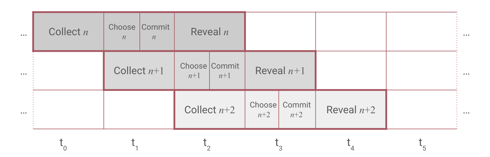

# How to use the State Connector?

The State Connector is a solution that bridges the gap between different blockchains, enabling the smooth exchange of information and synchronization of smart contracts and state changes.
In this blog, we will explore the significance of bridging data across blockchains and how the State Connector allows dapps on the Flare network to easily integrate connected chains.
Here we will explore the process of attesting to a payment on the Bitcoin network and using the proof on the Flare network.

This blog post contains code snippets to recreate the process of attesting to payment on the Bitcoin network and using the proof on the Flare network but does not provide a full setup guide.
The whole setup and the full code can be found on this [repo](https://github.com/flare-foundation/flare-demo-examples).
You are invited to follow along and try it yourself (with a different transaction).
The repository contains all the required code and instructions to set up the environment and run the code.
If you are new to Flare, we suggest you start your journey with the [Flare documentation](https://docs.flare.network/) and provided starter packs for [hardhat](https://github.com/flare-foundation/flare-hardhat-starter) or [foundry](https://github.com/flare-foundation/flare-foundry-starter), from which the code in this blog post is derived.

## The State Connector

The State Connector is a protocol running on the Flare Network that allows any smart contract on the network to query non-changing, verifiable information from other blockchains such as Bitcoin or XRPL.
The State Connector provides data in a decentralized manner and securely.
This is accomplished by using a set of independent **attestation providers** that fetch the required information from another blockchain and deliver it to the Flare Network.
The State Connector smart contract then checks if there is enough consensus among the received answers and publishes the results.

## Overlapped CCCR protocol

Flare's State Connector protocol operates in **attestation rounds**.
Each attestation round has 4 consecutive phases:

-   **Collect**: Users send their requests to the State Connector contract which emits events.
    Upon gathering the request, attestation providers assign them to a voting round according to the emission timestamp and try to assemble a response.
-   **Choose**: Attestation providers vote on which requests they will be able to provide valid responses in the current round.
-   **Commit**: Attestation providers send transactions with which they commit to the attested data for this round, but don't make the information public yet to prevent copying.
-   **Reveal**: Attestation providers reveal the attestation data.
-   **Count**: State Connector contract checks the revealed attestation data against committed data. If a majority agree on attestation data the result is published and stored on blockchain.

For each round, attestation providers assemble a Merkle tree where the leaves contain all the attestation responses of requests that were marked valid in choose phrase.
The attestation providers use only Merkle root as attestation data in the reveal phase.
This allows the consensus process to be lightweight and efficient. To act upon the attested request, the end user must provide the response and Merkle proof that proves the inclusion of the response in the Merkle tree.


You can read more about the State Connector [here](https://docs.flare.network/tech/state-connector/).

### Merkle Tree

[Merkle trees](https://en.wikipedia.org/wiki/Merkle_tree) are binary trees, where each leaf represents a hash of some data.
In our case, the data is the full response to the attestation request.
Each internal node (having two children) represents a hash of the concatenation of the hashes of its children.
In this way, all the responses are securely and efficiently represented with one hash.
Furthermore, we can easily check if a specific leaf is part of the tree by constructing a Merkle proof - a list of hashes that together with the Merkle root prove that the leaf is indeed part of the tree, this proof is logarithmic in size compared to the number of leaves in the tree.
This means that proving that a specific leaf is part of the tree is very efficient, while the tree can contain a lot of leaves: Proving a leaf in a tree with 1 million leaves requires only 20 hashes (compared to 1 million hashes if we would just store all the leaves in a list).

## Transferring external data to Flare

In this blog, we will focus on the [**payment attestation type**](https://github.com/flare-foundation/songbird-state-connector-protocol/blob/main/specs/attestations/active-types/Payment.md) - an attestation type designed to prove and relay data about a transaction that happened on an external chain for example Bitcoin.
We will write a simple script that will allow our smart contract deployed on Flare's testnet Coston to act upon a BTC transaction without a centralized oracle.

For example, we have made a transaction on BTC and would like to use this information on Flare.
Remember, Flare is EVM compatible blockchain, a proof of large transactions on an external chain that allows its use in an arbitrary computation - NFT issuance, immediate swap, and settlement with information from yet another chain...
We will achieve this in the following steps:

-   **Verification of the transaction**: We submit our BTC transaction to the verifier (a service provided by attestation providers or some other entity) of our choice.
    The verifier returns the JSON containing all the information about the transaction as well as a hex string representing an encoded attestation request to be submitted to the State Connector smart contract.

-   **Attestation request**: The hex-encoded request gets submitted to the State Connector smart contract.
    The smart contract then emits an event informing attestation providers about your request.

-   **CCCR phases**: Waiting for all four stages of the overlapped Collect-Choose-Commit-Reveal (CCCR) protocol to finalize.

-   **Merkle proof extraction**: Once the data is confirmed by the attestation clients and the State Connector contract reaches a consensus on the final Merkle root, the data about the transaction can be used on the Flare blockchain.
    To use the data we need: the response and Merkle proof. Both can be queried from the attestation provider of choice.

-   **Submitting Merkle proof**: Once we have the response and Merkle proof we submit them to our smart contract, which verifies that the proof is correct using a dedicated verification contract that checks the response against the stored Merkle root using the Merkle proof. (available both on the chain and in the state connector repository).

In the following section, we will look into each of those steps in detail, including how to implement them.

## Verification of the transaction

Let's pick a Bitcoin transaction we want to prove.
In this blog post, we will be using the transaction `01c17d143c03b459707f540fd5ee9f02a730c4cd114f310ef294b706ccf131d1`, that you can observe on the [blockchain explorer](https://blockstream.info/testnet/tx/01c17d143c03b459707f540fd5ee9f02a730c4cd114f310ef294b706ccf131d1).
The State Connector is able to prove any such transaction, so if you want to follow the blog post, go and fetch your favourite transaction from the Bitcoin network (or from Bitcoin testnet if you will be following on Coston).
The only requirements are that the transaction is not older than two days (to make indexers more efficient) and is confirmed by at least 6 blocks (to make sure, that a transaction included in the State Connector will remain on the main branch of blockchain).
The confirmation parameters for each other connected blockchain are different, and you can check them [here](https://github.com/flare-foundation/songbird-state-connector-protocol/tree/main/specs/attestations/configs.md).

Keep in mind, that we keep a strict separation between testing and production environments.
This means that if the State Connector on Songbird (or Flare) supports Bitcoin, Dogecoin and XRPL; Coston (or Coston2) supports Bitcoin testnet, Dogecoin testnet and XRPL testnet.
On the attestation client side, this usually means a different base URL (eg `coston.attester....` vs `songbird.attester....`), but you still need to provide `testBTC` for the name of the network instead of `BTC`, as the `sourceId` (network name) gets included in the transaction encoding.

We now know the hash of the transaction we want to prove (and by extension pretty much anything about this transaction).
The first thing we need to do is construct the encoded version of the data we want to prove.
We can do this by ourselves, but the process can get a bit complicated (and we would need to have an indexer at hand).
An easier way is to use the API already provided by verifiers (and any trusted verifier should be good enough) to construct such a message.
You can see the full verifier spec [here](https://github.com/flare-foundation/songbird-state-connector-protocol/tree/main/specs/attestations/verifier.md).
On default verifier implementations, we can get the encoded request by calling the `${ATTESTATION_URL}/verifier/btc/Payment/prepareRequest` endpoint as in the following code.

```typescript
// Simple hex encoding
function toHex(data) {
    var result = "";
    for (var i = 0; i < data.length; i++) {
        result += data.charCodeAt(i).toString(16);
    }
    return result;
}

const BTC_TRANSACTION_ID =
    "0x" + "01c17d143c03b459707f540fd5ee9f02a730c4cd114f310ef294b706ccf131d1";

async function prepareRequest() {
    const attestationType = toHex("Payment");
    const sourceType = toHex("testBTC");
    // Attestation Request object to be sent to API endpoint
    const requestData = {
        attestationType: attestationType,
        sourceId: sourceType,
        requestBody: {
            transactionId: BTC_TRANSACTION_ID,
            inUtxo: "3",
            utxo: "4",
        },
    };
    const response = await fetch(
        `${ATTESTATION_URL}/verifier/btc/Payment/prepareRequest`,
        {
            method: "POST",
            headers: {
                "X-API-KEY": API_KEY,
                "Content-Type": "application/json",
            },
            body: JSON.stringify(requestData),
        }
    );
    const data = await response.json();
    console.log("Prepared request:", data);
    return data;
}
```

The request is pretty simple and as we will see in the later blogposts, they all follow the same form.
We request attestation for a specific source (`testBTC` in our example) and attestation type (`Payment`).
Both the type and source are just hex-encoded strings (in exactly the same way as solidity does it) - this allows for easier extensibility.
The core part of the request is `requestBody` part.
The body is different for each attestation type (as each type requires different information).
In the case of payment type, we provide the transaction hash (which transaction we are looking at) and both `inUtxo` and `utxo` parameters, which provide a more granular control on the sender and recipient address (the details are defined by [payment type definition](https://github.com/flare-foundation/songbird-state-connector-protocol/blob/main/specs/attestations/active-types/Payment.md), which will be covered in a later section).

If the selected verifier is able to find this transaction on their own node or designated indexer, the API will return the following JSON (different if you use a different transaction or network):

```json
{
    "status": "VALID",
    "abiEncodedRequest": "0x5061796d656e7400000000000000000000000000000000000000000000000000746573744254430000000000000000000000000000000000000000000000000010594158b4a189785feda815241c4e6f299053a65b22c3d748e9f0a6c34372e501c17d143c03b459707f540fd5ee9f02a730c4cd114f310ef294b706ccf131d100000000000000000000000000000000000000000000000000000000000000080000000000000000000000000000000000000000000000000000000000000004"
}
```

The `status` field indicates that the verifier recognized this transaction as valid (it was included in a block in the correct time range), while the `abiEncodedRequest` contains all the data attestation clients need, to include it in the final Merkle root.
This is exactly the data we will be submitting to the State Connector contract, which will get emitted and picked up by attestation clients and (hopefully) proven and used on the chain.
Although the structure of `abiEncodedRequest` might seem daunting, it is actually pretty simple.
It is just a concatenated hex string (we first remove `0x`) of all the parts.
Each part is 32 bytes long (64 characters in hex) and represents a different part of the request.
To decode the first two parts, just use any online tool or try it [here](https://playcode.io/1752890).

```
5061796d656e7400000000000000000000000000000000000000000000000000
7465737442544300000000000000000000000000000000000000000000000000
10594158b4a189785feda815241c4e6f299053a65b22c3d748e9f0a6c34372e5
01c17d143c03b459707f540fd5ee9f02a730c4cd114f310ef294b706ccf131d1
0000000000000000000000000000000000000000000000000000000000000008
0000000000000000000000000000000000000000000000000000000000000004
```

-   The first line is just `toHex("Payment")`
-   The second line is `toHex("testBTC")`.
-   The third one is the **message integrity code** (`MIC`).
    It is a hash of the whole response salted with a string `Flare`, which allows the attestation clients to check that they really see the correct thing and forces the requester to first compute the desired response.
    The salt is there to force the attestation clients to really compute the whole request hash in the final Merkle root and not just copy it from the request.
    Read more about it [here](https://github.com/flare-foundation/songbird-state-connector-protocol/blob/main/specs/attestations/hash-MIC.md).
-   The rest is just the request data: transaction hash, inUtxo and utxo.

## Attestation request

The next step is to request attestation on the State Connector smart contract, thus broadcasting to the whole wide network that we want this to be proven.
This is the first time we will interact with the blockchain and make a transaction.
For that, we will need a small amount of CFLR to cover gas fees.
You can get your own testnet CFLR using [CFLR faucet](https://faucet.flare.network/).

```typescript
async function submitRequest() {
    const requestData = await prepareRequest();

    const stateConnector = await ethers.getContractAt(
        flareLib.nameToAbi("IStateConnector", "coston").data,
        flareLib.nameToAddress("StateConnector", "coston"),
    );

    // Call to the StateConnector protocol to provide attestation.
    const tx = await stateConnector.requestAttestations(
        requestData.abiEncodedRequest
    );
    const receipt = await tx.wait();

    // Get block number of the block containing contract call
    const blockNumber = receipt.blockNumber;
    const block = await ethers.provider.getBlock(blockNumber);

    // Get constants from State connector smart contract
    const BUFFER_TIMESTAMP_OFFSET = Number(await stateConnector.BUFFER_TIMESTAMP_OFFSET());
    const BUFFER_WINDOW = Number(await stateConnector.BUFFER_WINDOW());

    // Calculate roundId
    const roundId = Math.floor(block!.timestamp - BUFFER_TIMESTAMP_OFFSET) / BUFFER_WINDOW);
    // console.log("scRound:", roundId);
    return roundId;
}
```

Once we have requested attestation we can calculate `roundId` - The State Connector round that was in the collect phase the moment we requested attestation.
We now have to wait for the corresponding `Reveal` round to end to be able to get the proof.
This takes between 3 and 4.5 minutes (depending on when in the collect phase the request was submitted), due to overlapping phases, we do not need to wait 6 minutes to submit another request (if we want to), as the new round will commence immediately after collect phase ends (in a different round).
Importantly, we can get the proof immediately after the reveal phase ends, but we won't be able to use it until this phase is finalized (which happens with the next request to the state connector protocol - we will revisit this in the next sections).

## CCCR phases

When we requested attestation in the round with our fixed `roundId` the CCCR protocol was in the **collect phase** for that round.
Meaning that all the attestation providers were collecting and storing attestation requests.
This phase lasts 90 seconds.
Follows the **choose phase** in which attestation providers are voting on which of the requests they can confirm based on the state of their own nodes.
At the end of the the choose phase, the entire set of attestation providers agree upon which attestation requests they will confirm in this round.
The next phase is the **commit phase**.
By now, every attestation provider has its own copy of the Merkle tree containing hashes of responses to attestation requests as leaves (every attestation provider has an exact copy of the same tree).
In the commit phase, each provider submits the hash of the Merkle root (salted with a random number and their address).
Choose and commit phases last 45 seconds each (together 90 seconds and they coincide with the collect phase of the next round).

Lastly, the CCCR reaches the **reveal phase** (lasting 90 seconds) where each provider submits their Merkle root.
If there is enough consensus, the State Connector smart contract finalizes the round and makes the final Merkle root public and thus designates it at the Merkle root that was attested to in that specific round.

## Merkle proof extraction

The reveal phase has ended and the round we requested attestation in has been finalized, so there is a Merkle root stored in the State Connector smart contract.
As mentioned before, this Merkle root is the root of a Merkle tree containing hashes of responses to attestation requests as leaves, including the one we want to be proven.

We now need to get a Merkle proof - the proof, that the hash of our transaction is indeed part of the accepted Merkle tree (and was thus accepted by the group of attestors and State Connector smart contract).
The easiest way to do this is to use one of the attestation clients, as they already have the full Merkle tree constructed.

To extract the merkle proof we use `${ATTESTATION_URL}/attestation-client/api/proof/get-specific-proof` API endpoint:

```typescript
async function testAttestation(scRound, requestData) {
    const attestationProof = {
        roundId: scRound,
        requestBytes: requestData.abiEncodedRequest,
    };
    const response = await fetch(
        `${process.env.ATTESTER_BASE}/attestation-client/api/proof/get-specific-proof`,
        {
            method: "POST",
            headers: {
                "X-API-KEY": process.env.API_KEY,
                "Content-Type": "application/json",
            },
            body: JSON.stringify(attestationProof),
        }
    );

    // Verified attestation proof from verifiers API endpoint.
    const responseData = await response.json();
    console.log("Response", responseData);
}
```

We use the `roundId` in which the data was submitted in the previous step and the `abiEncodedRequest` we submitted earlier - if the attestation client has assembled the Merkle tree for the same round, getting the proof for them is just a simple lookup for the tree they submitted in that round.

The result of the call is the following JSON(you can read the [full spec](https://github.com/flare-foundation/songbird-state-connector-protocol/tree/main/specs/attestations/active-types/Payment.md)):

```json
{
    "status": "OK",
    "data": {
        "roundId": 791508,
        "hash": "0x893262e158c834e45015f45478e9dccda44f70d73854129666a9fe23e41a4a6a",
        "requestBytes": "0x5061796d656e7400000000000000000000000000000000000000000000000000746573744254430000000000000000000000000000000000000000000000000010594158b4a189785feda815241c4e6f299053a65b22c3d748e9f0a6c34372e501c17d143c03b459707f540fd5ee9f02a730c4cd114f310ef294b706ccf131d100000000000000000000000000000000000000000000000000000000000000080000000000000000000000000000000000000000000000000000000000000004",
        "request": {
            "attestationType": "0x5061796d656e7400000000000000000000000000000000000000000000000000",
            "messageIntegrityCode": "0x10594158b4a189785feda815241c4e6f299053a65b22c3d748e9f0a6c34372e5",
            "requestBody": {
                "inUtxo": "8",
                "transactionId": "0x01c17d143c03b459707f540fd5ee9f02a730c4cd114f310ef294b706ccf131d1",
                "utxo": "4"
            },
            "sourceId": "0x7465737442544300000000000000000000000000000000000000000000000000"
        },
        "response": {
            "attestationType": "0x5061796d656e7400000000000000000000000000000000000000000000000000",
            "lowestUsedTimestamp": "1707293909",
            "requestBody": {
                "inUtxo": "8",
                "transactionId": "0x01c17d143c03b459707f540fd5ee9f02a730c4cd114f310ef294b706ccf131d1",
                "utxo": "4"
            },
            "responseBody": {
                "blockNumber": "2577266",
                "blockTimestamp": "1707293909",
                "intendedReceivedAmount": "11091745",
                "intendedReceivingAddressHash": "0xd4045c296d33c3a727a40d8284b9b3d8fb65c1d8acc21da68143d6d1e4c19b39",
                "intendedSpentAmount": "25800382",
                "oneToOne": false,
                "receivedAmount": "11091745",
                "receivingAddressHash": "0xd4045c296d33c3a727a40d8284b9b3d8fb65c1d8acc21da68143d6d1e4c19b39",
                "sourceAddressHash": "0x477031ede55f3ca387013295a98360bafde1839c4a2f0726e6afdba725055aa7",
                "spentAmount": "25800382",
                "standardPaymentReference": "0x0000000000000000000000000000000000000000000000000000000000000000",
                "status": "0"
            },
            "sourceId": "0x7465737442544300000000000000000000000000000000000000000000000000",
            "votingRound": "791508"
        },
        "merkleProof": [
            "0x4773a018b7dfcf7390a882406c53fc73eb08f9ebadb637820284dc615b7906cb",
            "0x8ab24c478f9074e6b8f68ad08c6290819ec0e676ec0b6c42a9a3f0e43f510902",
            "0x9f2fac2dbb646f5c9758551744c876a20421340f34dfe09c05877cc4e5540b49"
        ]
    }
}
```

The response data contains multiple parts (the whole object will be sent to the verifier on the chain), where the general structure is the same for all attestation types.
It firstly contains the full data about the request we made to prepare the attestation in the previous step (So that the receiving smart contract can verify what request has been made).
Secondly, it contains the Merkle proof part - the proof that the verification contract will use to check, that this attestation really is included in the Merkle tree for the round `791508`
(in your response, the `roundId` will be different).
Importantly, the proof is quite short (logarithmic in size) compared to the number of attestations requested in the round.
The most important part is the response body, which we will now look at in detail.

The whole response (when the proof is moved inside) corresponds to the `Payment.Proof` in the following solidity interface:

```solidity
// SPDX-License-Identifier: MIT
pragma solidity >=0.7.6 <0.9;

/**
 * @custom:name Payment
 * @custom:id 0x01
 * @custom:supported BTC, DOGE, XRP, testBTC, testDOGE, testXRP
 * @author Flare
 * @notice A relay of a transaction on an external chain that is considered a payment in a native currency.
 * Various blockchains support different types of native payments.
For each blockchain, it is specified how a payment
 * transaction should be formed to be provable by this attestation type.
 * The provable payments emulate traditional banking payments from entity A to entity B in native currency with an optional payment reference.
 * @custom:verification The transaction with `transactionId` is fetched from the API of the blockchain node or relevant indexer.
 * If the transaction cannot be fetched or the transaction is in a block that does not have a sufficient [number of confirmations](/specs/attestations/configs.md#finalityconfirmation), the attestation request is rejected.
 *
 * Once the transaction is received, the [payment summary](/specs/attestations/external-chains/transactions.md#payment-summary) is computed according to the rules for the source chain.
 * If the summary is successfully calculated, the response is assembled from the summary.
 * `blockNumber` and `blockTimestamp` are retrieved from the block if they are not included in the transaction data.
 * For Bitcoin and Dogecoin, `blockTimestamp` is mediantime of the block.
 * For XRPL, `blockTimestamp` is close time of the ledger converted to UNIX time.
 *
 * If the summary is not successfully calculated, the attestation request is rejected.
 * @custom:lut `blockTimestamp`
 */
interface Payment {
    /**
     * @notice Toplevel request
     * @param attestationType ID of the attestation type.
     * @param sourceId ID of the data source.
     * @param messageIntegrityCode `MessageIntegrityCode` that is derived from the expected response.
     * @param requestBody Data defining the request.
Type (struct) and interpretation is determined by the `attestationType`.
     */
    struct Request {
        bytes32 attestationType;
        bytes32 sourceId;
        bytes32 messageIntegrityCode;
        RequestBody requestBody;
    }

    /**
     * @notice Toplevel response
     * @param attestationType Extracted from the request.
     * @param sourceId Extracted from the request.
     * @param votingRound The ID of the State Connector round in which the request was considered.
     * @param lowestUsedTimestamp The lowest timestamp used to generate the response.
     * @param requestBody Extracted from the request.
     * @param responseBody Data defining the response.
The verification rules for the construction of the response body and the type are defined per specific `attestationType`.
     */
    struct Response {
        bytes32 attestationType;
        bytes32 sourceId;
        uint64 votingRound;
        uint64 lowestUsedTimestamp;
        RequestBody requestBody;
        ResponseBody responseBody;
    }

    /**
     * @notice Toplevel proof
     * @param merkleProof Merkle proof corresponding to the attestation response.
     * @param data Attestation response.
     */
    struct Proof {
        bytes32[] merkleProof;
        Response data;
    }

    /**
     * @notice Request body for Payment attestation type
     * @param transactionId ID of the payment transaction.
     * @param inUtxo For UTXO chains, this is the index of the transaction input with source address.
Always 0 for the non-utxo chains.
     * @param utxo For UTXO chains, this is the index of the transaction output with receiving address.
Always 0 for the non-utxo chains.
     */
    struct RequestBody {
        bytes32 transactionId;
        uint256 inUtxo;
        uint256 utxo;
    }

    /**
     * @notice Response body for Payment attestation type
     * @param blockNumber Number of the block in which the transaction is included.
     * @param blockTimestamp The timestamp of the block in which the transaction is included.
     * @param sourceAddressHash Standard address hash of the source address.
     * @param receivingAddressHash Standard address hash of the receiving address.
The zero 32-byte string if there is no receivingAddress (if `status` is not success).
     * @param intendedReceivingAddressHash Standard address hash of the intended receiving address.
Relevant if the transaction is unsuccessful.
     * @param spentAmount Amount in minimal units spent by the source address.
     * @param intendedSpentAmount Amount in minimal units to be spent by the source address.
Relevant if the transaction status is unsuccessful.
     * @param receivedAmount Amount in minimal units received by the receiving address.
     * @param intendedReceivedAmount Amount in minimal units intended to be received by the receiving address.
Relevant if the transaction is unsuccessful.
     * @param standardPaymentReference [Standard payment reference](/specs/attestations/external-chains/standardPaymentReference.md) of the transaction.
     * @param oneToOne Indicator whether only one source and one receiver are involved in the transaction.
     * @param status  [Succes status](/specs/attestations/external-chains/transactions.md#transaction-success-status) of the transaction: 0 - success, 1 - failed by sender's fault,x  2 - failed by receiver's fault.
     */
    struct ResponseBody {
        uint64 blockNumber;
        uint64 blockTimestamp;
        bytes32 sourceAddressHash;
        bytes32 receivingAddressHash;
        bytes32 intendedReceivingAddressHash;
        int256 spentAmount;
        int256 intendedSpentAmount;
        int256 receivedAmount;
        int256 intendedReceivedAmount;
        bytes32 standardPaymentReference;
        bool oneToOne;
        uint8 status;
    }
}
```

Let's look at the `ResponseBody` part of the response in full detail.
This is the meat of the entire attestation, that we will use on the Flare chain.
Assuming that we wanted to make sure that someone paid us on the Bitcoin network and used the payment to mint an NFT on Flare, we would rigorously check that they paid enough, the payment was accepted, and that they paid to the correct address and so.
This is exactly what the `ResponseBody` contains, let's dig in.

-   `blockNumber`: This is the block number of the block (on the underlying chain), in which the transaction was included.
    Not really relevant for us, but might be important for some more specific applications (make sure that some transactions happen in the correct order).
-   `blockTimestamp`: This is the timestamp of the block (on the underlying chain) in which the transaction was included.
    This is quite important if we want to make sure, that the transaction was fast enough (e.g., if we want to mint an NFT, we might want to make sure that the payment was made in the last X minutes).
-   `sourceAddressHash`: This is the hash of the address that made the payment.
    Sometimes you want to make sure, that the payment was made from a specific address (e.g. if you want to mint an NFT only for the person that paid you).
    This is the hash of the address, so you will need to hash the address you want to check and compare it to this field.
    The reason we use hash instead of address directly is the fact that when multiple chains are supported, the address might be in different formats (e.g., for BTC it is in base58, for ETH in hex) and lengths.
    An important thing to consider for utxo-based chains (BTC, DOGE) is that there is not a single address that made the payment, but rather a set of addresses that were used as inputs to the transaction.
    State Connector proof gives us only the hash of the **selected payee** address.
    How do we know which address was selected?
    Using the `utxo` field in the request form.
    When the transaction is processed on utxo chains, unspent outputs (and newly created inputs) are ordered and by specifying the `utxo` field we instruct the State Connector which one of the outputs was to consider when calculating as the payee in the response.
    For non-utxo (currently XRPL) chains, this is the hash of the (only one) address that was specified in the transaction as the sender.
-   `receivingAddressHash`: This is the hash of the address that received the payment.
    Similarly, as with the `sourceAddressHash` this is the hash of the address, so you will need to hash the address you want to check and compare it to this field.
    As utxo-based chains (BTC, DOGE) can have multiple outputs, the `receivingAddressHash` is the hash of the **selected receiver** address - the one specified by the `inUtxo` field in the request.
    For non-utxo (currently XRPL) chains, this is the hash of the (only one) address that was specified in the transaction as the receiver.

    In our example, this is the `keccak256` of the address that can unlock the utxo at index 4 (bitcoin address `2NBzM49JAFQrFKD8FnxSaJ8kGLau1JGJ66o`) - as specified in the request.

-   `intendedReceivingAddressHash`: This is the hash of the address that was intended to receive the payment.
    This only makes sense if the transaction was unsuccessful (e.g., the payment was reverted by the receiver, or something went wrong).
    This currently only makes sense on XRPL, as unsuccessful transactions are not included in Bitcoin or Dogecoin blocks.
-   `spentAmount`: This is the amount that was spent by the sender.
    Importantly, as we designate the sender by the `inUtxo` field, this is the amount that was spent from all the inputs in this transaction (not just the one we selected) controlled by the address that unlocked the selected input minus the amount sent to outputs controlled by the address unlocking the inputs.
    Think of it as the amount that was really spent from the sender's address - one might think of the State Connector as doing the full accounting.
-   `intendedSpentAmount`: This is the amount that was intended to be spent by the sender.
    This only makes sense if the transaction was unsuccessful (e.g., the payment was reverted by the receiver, or something went wrong).
    This currently only makes sense on XRPL, as unsuccessful transactions are not included in Bitcoin or Dogecoin blocks.
-   `receivedAmount`: This is the amount that was received by the receiver.
    Importantly, as we designate the receiver by the `utxo` field, this is the amount that was received by the address that unlocked the selected output minus the amount sent to outputs controlled by the address unlocking the inputs.
    Think of it as the amount that was really received by the receiver's address - one might think of the State Connector as doing the full accounting.
-   `intendedReceivedAmount`: This is the amount that was intended to be received by the receiver.
    This only makes sense if the transaction was unsuccessful (e.g., the payment was reverted by the receiver, or something went wrong).
    This currently only makes sense on XRPL, as unsuccessful transactions are not included in Bitcoin or Dogecoin blocks.
-   `standardPaymentReference`: This is the standard payment reference of the transaction.
    This is a 32-byte string that you can use to encode additional information about the payment (e.g., invoice number, order number, etc.).
    Be careful, the payment reference specification is a lot more involved and you should read the full specification [here](https://github.com/flare-foundation/songbird-state-connector-protocol/tree/main/specs/attestations/external-chains/standardPaymentReference.md).
    But most of the time you will just want to check that the payment reference is the same as the one you expected (for example: the hash of the invoice ID you expect the payment for and the address that should be paying for it).
-   `oneToOne`: This is a boolean that indicates whether the transaction was one-to-one.
    The transaction is one-to-one when all of the following holds - All inputs are controlled by the same address (source address) - Outputs may consist only of UTXOs wiring to `receivingAddress`,
-   `status`: This is the status of the transaction.
    This is an integer that can be either 0, 1, or 2. - 0: The transaction was successful. - 1: The transaction was unsuccessful due to the sender's fault. - 2: The transaction was unsuccessful due to the receiver's fault (applicable only for XRPL).
    The full specification on how transactions are considered successful or unsuccessful can be found [here](hhttps://github.com/flare-foundation/songbird-state-connector-protocol/tree/main/specs/attestations/external-chains/transactions.md#transaction-success-status).

Transaction hash is not included in the response body, as it is already included in the request body (we don't want to unnecessarily repeat the data), but as it is part of the request body, it is also part of the Merkle proof (as the Merkle proof is constructed from the whole structure).
Keep in mind, that if you want to use this proof on chain (users want to purchase something), you might want to make sure, that you do not allow them to use the same proof twice (e.g., by checking that the transaction hash is not already used in your contract - unless the sender is different).

### Type structure

Let's examine the `Payment` interface in details.
Each of the attestation types we will see in the future will have the same form, so it is important to understand it.
There are at least 5 parts of the interface:
- `Request` - the request structure, having the `attestationType`, `sourceId`, `messageIntegrityCode` and `requestBody`.
The first three fields are the same for all attestation types, while the `requestBody` is specific to the attestation type.
In our case, the request body contains exactly the things we requested in the first place - the transaction hash and the utxo indices.
And if you look closely, the unpacking of the request we made to the state connector (the 6 lines) is exactly abi encoded version of the `requestBody` part of the `Request` structure.
This is also exactly how it is generated in the attestation client and it also makes it easy for attestation providers to unpack it, by taking the first field, the rest of the date is decoded by simply parsing the correct type.
- `Response` is the full response structure.
Again, the first four fields are the same for all attestation types, while the `responseBody` is specific to the attestation type.
The first two fields identify the attestation request and chain. `votingRound` allows us to check in which round the request was submitted (important to get the correct merkle root with which to check the proof). While the `lowestUsedTimestamp` is the lowest timestamp used to generate the response.
- `Proof` is the full structure we pass around. It contains the `Response` (which in turn also contains the `Request` - apart from knowing the result it also make sense to know what information exactly was requested) and the `merkleProof`, a list of merkle hashes that prove that the response is included in the merkle tree designated by the `votingRound` in the `Response`.
- `RequestBody` is the structure of the request body.
This one is specific to the attestation type and contains the data that is used to construct the response.
You can make it as complex as you want, but it is important to keep it as simple as possible, as nested structures are harder (and much more expensive) to work with.
- `ResponseBody` is the structure of the response body.
This one is specific to the attestation type and contains the data you want to use on chain.
You can make it as complicated as possible - add lists, nested structures, etc, but it is important to keep it as simple as possible, as nested structures are harder (and much more expensive) to work with.

## Submitting Merkle proof

The usual interaction a contract on the Flare chain will have will consist of two parts

-   Checking that the relayed information is sufficient to perform the action (e.g., checking that the payment was large enough to mint an NFT).
    We already explained what information is available in the previous section.
-   Checking that this information really was relayed by the State Connector and that the Merkle proof is correct.
    This is done by submitting the Merkle proof to the verification contract.
    We will see the verification contract in action in the next section.
    This is available after the reveal phase of the round in which the request was submitted has ended, and the round has been **finalized**.
    This happens with the first request to the State Connector smart contract after the reveal phase has ended.
    The easiest way to check if the round has been finalized is to check the `lastFinalizedRoundId` method on the State Connector smart contract.

A Verifier contract is just a simple wrapper around openzeppelin's Merkle proof verification contract.
The code verifier contracts can be found on [repository](https://github.com/flare-foundation/songbird-state-connector-protocol/tree/main/contracts/generated/verification), but we have deployed them on Coston testnet for you to use and are already added to the periphery library unofficial contract registry.

The verifier interface looks like this (we already know what the payment interface looks like):

```solidity
// SPDX-License-Identifier: MIT
pragma solidity >=0.7.6 <0.9;

import "../../../interface/types/Payment.sol";

interface IPaymentVerification {
    function verifyPayment(Payment.Proof calldata _proof) external view returns (bool _proved);
}
```

The `verifyPayment` function takes the `Payment.Proof` structure as an argument and returns a boolean indicating whether the proof is correct.

The whole contract is just a wrapper that gets the Merkle root from the State Connector contract and verifies the proof against it:

```solidity
// SPDX-License-Identifier: MIT
pragma solidity 0.8.20;

import "../../interface/types/Payment.sol";
import "../../interface/external/IMerkleRootStorage.sol";
import "./interface/IPaymentVerification.sol";
import {MerkleProof} from "@openzeppelin/contracts/utils/cryptography/MerkleProof.sol";

contract PaymentVerification is IPaymentVerification {
   using MerkleProof for bytes32[];

   IMerkleRootStorage public immutable merkleRootStorage;

   constructor(IMerkleRootStorage _merkleRootStorage) {
      merkleRootStorage = _merkleRootStorage;
   }

   function verifyPayment(
      Payment.Proof calldata _proof
   ) external view returns (bool _proved) {
      return _proof.data.attestationType == bytes32("Payment") &&
         _proof.merkleProof.verify(
            merkleRootStorage.merkleRoot(_proof.data.votingRound),
            keccak256(abi.encode(_proof.data))
         );
   }
}
```

We will first check the proof off-chain (remember, verification is just a view method) and then create a simple contract that will store the verifications and verify them on-chain.

```typescript
export async function checkMerkleProof(scRound: number) {
    // Check that the round is already finalized
    const stateConnector = await ethers.getContractAt(
        flareLib.nameToAbi("IStateConnector", "coston").data,
        flareLib.nameToAddress("StateConnector", "coston")
    );

    const lastFinalized = await stateConnector.lastFinalizedRoundId();

    if (scRound > lastFinalized) {
        console.log("scRound:", scRound, "is not finalized yet");
        return;
    }

    const response = await requestMerkleProof(scRound);

    const paymentVerifier = await ethers.getContractAt(
        flareLib.nameToAbi("IPaymentVerification", "coston").data,
        flareLib.nameToAddress("IPaymentVerification", "coston")
    );
    const payment = {
        data: response.data.response,
        merkleProof: response.data.merkleProof,
    };

    const tx = await paymentVerifier.verifyPayment(payment);
    console.log("Verification tx:", tx);
    return payment;
}
```

Running this we get:

```
Verification tx: true
```

Yay!
That means that the verifier has accepted our Merkle proof and concluded the entire process.

## On chain verification

The verification on-chain is similarly simple.
We just query the verifier - in the same way as off-chain and that's it.
And you can see, that the verification method is just a view method, so it doesn't cost us anything to verify the proof on chain (apart from minimal gas costs).

Here is a simple contract that will verify the proof on the chain and tally the total values transacted.

```solidity
// SPDX-License-Identifier: MIT

import {IPaymentVerification} from "@flarenetwork/flare-periphery-contracts/coston/stateConnector/interface/IPaymentVerification.sol";
import {Payment} from "@flarenetwork/flare-periphery-contracts/coston/stateConnector/interface/Payment.sol";
import {FlareContractsRegistryLibrary} from "@flarenetwork/flare-periphery-contracts/coston/util-contracts/ContractRegistryLibrary.sol";

pragma solidity ^0.8.20;

contract PaymentAggregationExample {
    mapping(bytes32 => uint256) public totalReceived;
    mapping(bytes32 => mapping(bytes32 => bool)) public transactionProcessed;

    Payment.Proof[] public processedPayments;

    function isPaymentValid(
        Payment.Proof calldata payment
    ) public view returns (bool) {
        // Use the library to get the verifier contract and verify that is
        return
            FlareContractsRegistryLibrary
                .auxiliaryGetIPaymentVerification()
                .verifyPayment(payment);
    }

    function addPayment(Payment.Proof calldata payment) public {
        // Check with state connector
        require(
            isPaymentValid(payment),
            "Payment is not confirmed by the State Connector"
        );

        // Additional dApp dependent checks

        // We only accept testBTC payments
        require(
            payment.data.sourceId ==
                0x7465737442544300000000000000000000000000000000000000000000000000,
            "Payment made on incorrect chain"
        );

        // We don't want to double count payments
        require(
            transactionProcessed[
                payment.data.responseBody.receivingAddressHash
            ][payment.data.requestBody.transactionId] == false,
            "Payment already processed"
        );
        transactionProcessed[payment.data.responseBody.receivingAddressHash][
            payment.data.requestBody.transactionId
        ] = true;

        if (payment.data.responseBody.receivedAmount > 0) {
            totalReceived[
                payment.data.responseBody.receivingAddressHash
            ] += uint256(payment.data.responseBody.receivedAmount);
        }

        processedPayments.push(payment);
    }
}
```

The code is pretty simple and short!

Let's take a look at the most important functions:

-   `isPaymentValid`: this **view** function checks, that the provided payment is valid - included in the State Connector.
    We use the Flare-provided PaymentVerification contract to do this together with the periphery library to directly get the verifier contract.
    The body is pretty simple - we just call the `verifyPayment` method on the verifier contract and that's it.
    Don't forget that this is a **view** function, so it doesn't cost us anything to check the proof on the chain.
-   `addPayment`: this function is the one that will be called by the users to add the payment to the contract.
    Remember, using the State Connector on the chain is usually a two-step process.
    We firstly check that the provided proof and data are valid using the verifier and secondly, we check, that the provided data is valid for our specific use case - in our case, that it is a payment in testBTC.
    After we are sure that the payment is valid, we tally the total amount received and store the proof for future reference.

## Conclusion

In the context of a larger application, this entire pipeline would be integrated and triggered every time your dApp needs data from an external blockchain.
Through its innovative approach, leveraging independent attestation providers and an overlapped CCCR protocol, the State Connector ensures decentralized and secure data access.
This blog has provided an exploration of the attestation rounds, the Merkle tree structure, and the practical implementation of the State Connector for verifying transactions on external chains.
With the ability to bridge data effectively, the State Connector is shaping the future of decentralized collaboration by facilitating trustless interactions between different blockchain networks.

Remember, the whole code can be found on this [repo](https://github.com/flare-foundation/flare-demo-examples), where you can find some additional examples and a few helpful scripts to run everything on your own.

## Additional useful methods

We have shown how you can request the attestation and then use the response, but sometimes you might want to get just the response without the proof (there is no proof or round to speak about) or anything related to the State Connector confirmation procedure.
But it gives you the same data as you would get from the State Connector, so you can use it to debug and verify the data you are getting from the State Connector.

To achieve this, just query the `prepareResponse` endpoint with the same data as `prepareRequest`.
In that case, you will get only the response part, but this is enough, to see if the response is correct and verify locally, that that is really the one you want to have proven.

```typescript
async function getPreparedResponse() {
    const attestationType = toHex("Payment");
    const sourceType = toHex("testBTC");
    // Attestation Request object to be sent to API endpoint
    const requestData = {
        "attestationType": attestationType,
        "sourceId": sourceType,
        "requestBody": {
            "transactionId": BTC_TRANSACTION_ID,
            "inUtxo": "8",
            "utxo": "4"
        }
    }

    const response = await fetch(
        `${ATTESTATION_URL}/verifier/btc/Payment/prepareResponse`,
        {
            method: "POST",
            headers: { "X-API-KEY": ATTESTATION_API_KEY as string, "Content-Type": "application/json" },
            body: JSON.stringify(requestData)
        }
    );
    const data = await response.json();
    console.log("Prepared response:", data);
    return data;
}
```

And we get just the response part - compare it, it is the same as the one we used to interact with the contract.
```json
{
  "status": "VALID",
  "response": {
    "attestationType": "0x5061796d656e7400000000000000000000000000000000000000000000000000",
    "lowestUsedTimestamp": "1707293909",
    "requestBody": {
        "inUtxo": "8",
        "transactionId": "0x01c17d143c03b459707f540fd5ee9f02a730c4cd114f310ef294b706ccf131d1",
        "utxo": "4"
    },
    "responseBody": {
        "blockNumber": "2577266",
        "blockTimestamp": "1707293909",
        "intendedReceivedAmount": "11091745",
        "intendedReceivingAddressHash": "0xd4045c296d33c3a727a40d8284b9b3d8fb65c1d8acc21da68143d6d1e4c19b39",
        "intendedSpentAmount": "25800382",
        "oneToOne": false,
        "receivedAmount": "11091745",
        "receivingAddressHash": "0xd4045c296d33c3a727a40d8284b9b3d8fb65c1d8acc21da68143d6d1e4c19b39",
        "sourceAddressHash": "0x477031ede55f3ca387013295a98360bafde1839c4a2f0726e6afdba725055aa7",
        "spentAmount": "25800382",
        "standardPaymentReference": "0x0000000000000000000000000000000000000000000000000000000000000000",
        "status": "0"
    }
  }
}
```

## Automate this process

### XRP Ledger

Let's automate this process and create a script, that creates a transaction on external chain and immediately try to see what request we would get from the state connector.

In the file `tryXRPLTransactionVerification.ts` we have a simple script, that creates an XRPL transaction to some predefined address - you can change this if you want to.
To make it work, just populate the `.env` file with `XRPL_PRIVATE_KEY` that has some testnet XRP (https://test.bithomp.com/faucet/) on it and run the script.

In the file `tryXRPLTransactionVerification.ts` we create a transaction on the XRPL testnet and then immediately try to see what request we would get from the state connector.
The code is pretty simple, the only important part is properly encoding the standard payment reference and pad it to 32 bytes.
If standard payment reference conforms to the specification, it will also be returned in the response from the State Connector.

An example result would be 
```
See transaction at https://testnet.xrpl.org/transactions/1D3FC0F8A2E509F2C4EC2F2F446075A60674C7C7EFE04948632444088FF54B42
{
  status: 'VALID',
  response: {
    attestationType: '0x5061796d656e7400000000000000000000000000000000000000000000000000',
    sourceId: '0x7465737458525000000000000000000000000000000000000000000000000000',
    votingRound: '0',
    lowestUsedTimestamp: '1708820060',
    requestBody: {
      transactionId: '0x1D3FC0F8A2E509F2C4EC2F2F446075A60674C7C7EFE04948632444088FF54B42',
      inUtxo: '0',
      utxo: '0'
    },
    responseBody: {
      blockNumber: '45677518',
      blockTimestamp: '1708820060',
      sourceAddressHash: '0xa1ca3089c3e9f4c6e9ccf2bfb65bcf3e9d7544a092c79d642d5d34a54e0267e1',
      receivingAddressHash: '0x0555194538763da400394fc7184432e9a006565fa710392ea1a86486eb83920f',
      intendedReceivingAddressHash: '0x0555194538763da400394fc7184432e9a006565fa710392ea1a86486eb83920f',
      standardPaymentReference: '0x48656C6C6F20776F726C64210000000000000000000000000000000000000000',
      spentAmount: '22',
      intendedSpentAmount: '22',
      receivedAmount: '10',
      intendedReceivedAmount: '10',
      oneToOne: true,
      status: '0'
    }
  }
}
Hello world!
```

### Bitcoin (and Dogecoin)

The process is similar, we create a simple transaction with `OP_RETURN` that carries the payment reference.
Due to the security assumptions, we can't use the same script to immediately check the response, as Bitcoin verification requires 6 confirmations and Dogecoin 60 confirmations - which usually takes just a bit under an hour.

The script therefore only creates the transaction and prints the transaction hash or uses a provided transaction hash to check the response from the State Connector.

<!--TODO:finish this code-->

## Important links

To make your life easier in the future, all the important links and resources are listed below:

-   Flare [hardhat](https://github.com/flare-foundation/flare-hardhat-starter) and [foundry](https://github.com/flare-foundation/flare-foundry-starter) starter packs. They already include the latest versions of periphery packages.
-   State connector specification [repo](https://git.aflabs.org/flare-external/state-connector-protocol-public/-/tree/main).
-   Demo repository containing all the code from this blog [repo](https://github.com/flare-foundation/flare-demo-examples).
-   Current deployment of the State Connector on Coston testnet [0x0c13aDA1C7143Cf0a0795FFaB93eEBb6FAD6e4e3](https://coston-explorer.flare.network/address/0x0c13aDA1C7143Cf0a0795FFaB93eEBb6FAD6e4e3).